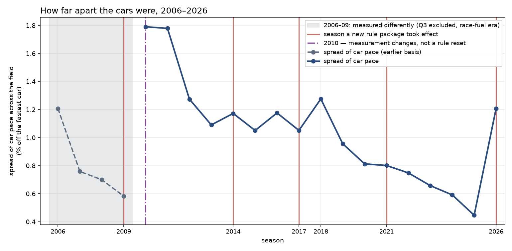
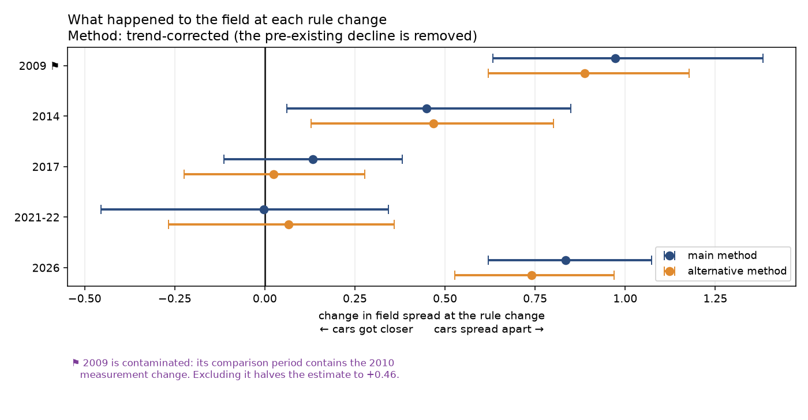
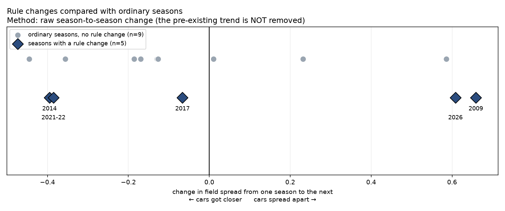

# Did F1's regulation resets actually close up the field?

**No. Across five technical regulation boundaries from 2006 to 2026, none shows
the field narrowing beyond its existing trend — and three of the five show it
widening. The field did converge steadily over two decades, but that convergence
happened between the resets, not at them.**

The one reset that explicitly promised a closer field — the 2021–22 cost cap and
ground-effect package — produced no measurable narrowing under any of three
specifications. The five boundaries do not share a common effect (I² = 86%), so
the per-boundary result is the finding and the pooled estimate is not.

Read [`memo.md`](memo.md) for the full result and
[`LIMITATIONS.md`](LIMITATIONS.md) for what would change it. The most important
caveat is in the memo's first paragraph: this measures *field convergence*, and
F1 mostly promises *raceability*. They are different things, and every null here
is consistent with the regulations succeeding at what they actually aimed for.

---

Formula 1 rewrites its technical regulations every few years, and each time the
stated goal is closer racing. This project tests whether that happened, using
timing data rather than the two measures usually reached for. Championship points
lag actual car performance by up to a full season and are distorted by
reliability, crashes, and changes to the scoring system. Overtake counts are
inflated by DRS trains and pit-stop cycles, and they count position changes that
involved no racing at all. Neither measures what the regulations are supposed to
affect: how far apart the cars actually are. So the analytical core of this
project is designing a defensible competitiveness metric from lap and qualifying
times, then testing whether it moved at each regulation boundary. The metric
design is as much the deliverable as the answer.

## Status

**Analysis complete. Phases 0–7 delivered.**

| Phase | State |
|---|---|
| 0 — Analysis plan (pre-registration) | Committed and tagged before any code |
| 1 — Acquisition and coverage report | Complete |
| 2 — Cleaning and row-loss ledgers | Complete |
| 3 — Pace model | Complete; all four ship gates pass |
| 4 — Competitiveness metrics | Complete |
| 5 — Reset analysis | Complete |
| 6 — Red team and robustness battery | Complete |
| 7 — Memo and deliverables | Complete |

The plan carries four amendments, each a separate commit stating what changed and
why. The `pre-registration` tag has never moved. 61 decisions are logged in
[`DECISIONS.md`](DECISIONS.md), append-only.

## Headline numbers

Primary metric M2 (robust field spread), segmented interrupted time series.
Positive = the field widened at the reset.

| boundary | level change | 95% CI | survives Holm |
|---|---:|---|:---:|
| 2009 ⚑ | **+0.973** | [+0.633, +1.382] | yes |
| 2014 | +0.449 | [+0.062, +0.849] | no |
| 2017 | +0.133 | [−0.113, +0.382] | no |
| 2021–22 | −0.003 | [−0.455, +0.343] | no |
| 2026 (provisional) | **+0.834** | [+0.621, +1.073] | yes |

Pooled: +0.480 [−0.046, +1.007], p = 0.064 against a Holm threshold of 0.025 —
**does not reject**. Two pre-registered falsification criteria fire independently.

29% of the 2026 widening is attributable to the eleventh constructor joining that
season; the constant-constructor estimate is +0.596 [+0.388, +0.813]. 2026 covers
13 of 23 rounds and is provisional.

⚑ **The 2009 estimate is contaminated.** Its comparison window contains the 2010
measurement change; excluding that halves it to **+0.461** [+0.089, +0.980]. It
remains a widening, so the headline is unaffected. See
[`memo.md`](memo.md) and [`LIMITATIONS.md`](LIMITATIONS.md).

## The result in three charts



**How far apart the cars were, season by season.** Each dot is one season. Higher
means the cars were more spread out in pace; lower means they were closer
together. The line falls steeply — the cars really did get closer. But look at
*where* it falls: mostly in the gaps between the red lines, which mark the seasons
a new rule package took effect.

The shaded block on the left is drawn separately for a reason. **Before 2010 we
are measuring something slightly different**, because qualifying then was run with
race fuel on board and that part of the session has to be excluded. The purple
line marks 2010, where three brand-new teams joined, refuelling was banned, and
the measurement basis changed all at once — so the jump there is mostly *us*, not
the racing. **Do not read the two sections as one continuous line.** Each declines
steeply on its own, which is the point: 1.21 → 0.58 before the break, 1.79 → 0.45
after it.



**What happened at each rule change.** The dot is our best estimate of how the
field changed at that rule change. The horizontal bar shows the range the true
value plausibly sits in — a bar that crosses the black zero line means we cannot
tell the difference from "nothing happened at all." Two methods are shown because
the choice between them is a judgement call, and we would rather show both than
pick one quietly. **2009, 2014 and 2026 sit to the right of zero: the cars spread
apart. 2017 and 2021–22 straddle zero: nothing measurable. Nothing sits clearly
to the left.** 2009 carries a flag: its comparison period contains the 2010
measurement change, and excluding that halves the estimate to +0.46. It stays a
widening either way.

> **The next chart uses a different method, and that is why some seasons appear
> to disagree with the one above.** The chart above removes the field's
> pre-existing trend — the cars were already getting closer year on year — and
> asks whether the rule change moved things *beyond* that. The chart below does
> not remove the trend; it just shows the raw change from one season to the next.
> **2014 and 2017 flip sides between the two for exactly that reason.** Neither
> is wrong; they answer different questions, and which one you think is the right
> question is the single biggest judgement call in this analysis.



**Rule changes compared with ordinary seasons.** The grey dots are ordinary
seasons where nothing much changed in the rules — they show how much the field
moves around on its own, year to year. The dark diamonds are the five rule
changes. **If rule changes did something special, the diamonds should sit further
from the centre than the grey dots do. They mostly do not.** Two of them (2009,
2026) sit out to the right, in the direction of the cars spreading apart.

## Method

Lap-level timing data does not reach back far enough to cover the older
regulation resets, so the analysis runs as two independent tiers and compares
them.

**Tier A — long history, coarse metric.** Qualifying-derived field spread,
sourced from Jolpica. Each team is represented by its best qualifying lap at an
event, normalised to a percentage off the fastest team so that circuits of
different lap length are comparable. Lower resolution, wider coverage; brackets
several regulation resets. Qualifying is low fuel, fresh tyres, maximum attack
and minimal traffic, which makes it a clean read on car performance — this tier
is a serious candidate for the primary metric, not a fallback.

**Tier B — recent history, rich metric.** Fuel- and tyre-corrected race pace from
FastF1, 2018–2026 (floor verified empirically: 2014–2017 return no lap data at
all). A per-race regression strips out fuel load, tyre compound, and tyre age to
recover underlying car pace, which is then normalised the same way as Tier A.
Higher resolution, narrower coverage; brackets the two most recent resets.

> **Tier B is corroboration only. It cannot carry an independent conclusion.**
> Its placebo pool is two boundaries, and the 2021–22 boundary has just one
> unflagged pre-season (2018; 2019 and 2020 are both flagged discontinuities).
> Tier B can support or undercut a Tier A result. It cannot establish one on its
> own, and no claim in this repository rests on Tier B alone.

Where the tiers agree, confidence rises. Where they disagree, the disagreement is
reported as a finding rather than reconciled away.

Regulation boundaries are tested with segmented interrupted time-series models,
estimating both the level change at the boundary and the slope change after it.
Confidence intervals come from a cluster bootstrap over events. A placebo test
fits the same model at non-reset season boundaries: if real resets do not produce
larger shifts than arbitrary ones, that is the answer.

## Analysis plan

[`ANALYSIS_PLAN.md`](ANALYSIS_PLAN.md) contains the question, the hypotheses, the
metric formulas, the exclusion rules, the statistical tests, the confounds known
in advance, and — importantly — what result would prove the hypothesis wrong.

**It was committed before any analysis code existed.** That commit is tagged
[`pre-registration`](../../releases/tag/pre-registration) and the history before
it is never rewritten. The point is that the conclusions cannot have been
reverse-engineered from the results. If the plan changes after that tag, the
change is a new commit stating what changed and why, never an amendment.

## Reproduction

```bash
git clone https://github.com/Dishank13/f1-regulation-competitiveness.git
cd f1-regulation-competitiveness
python -m venv .venv
.venv/Scripts/activate        # Windows;  source .venv/bin/activate elsewhere
pip install -r requirements.txt

python -m src.pipeline            # acquisition through deliverables
python -m src.pipeline analysis   # everything downstream of acquisition, no network
python -m src.pipeline --list     # show every stage without running
```

**Use the Python entry point, not `make`.** `make` is not installed by default on
Windows, which is where this analysis was run. A `Makefile` with the same stages
is provided for anyone who has it, plus `make verify` to check the decision
ledger for duplicated or non-contiguous entries.

**A fresh clone must acquire before it can analyse.** The raw caches and the
processed Parquet are gitignored, so `analysis` on a clean checkout stops with an
explicit message telling you to run `acquire` first. Acquisition reads the FastF1
live-timing API, which is rate limited to 500 calls/hour; it is resumable and
cache-first, so re-running costs nothing for sessions already on disk, but the
first full run takes several hours.

Two separate rate limits apply during acquisition and both are handled by
backing off and retrying: FastF1's own live-timing limiter, and HTTP 429 from
Jolpica, which FastF1 calls internally to fill in first-lap times. Expect the
first acquisition to spend a lot of its wall time asleep.

Processed tables are written to `data/processed/` as Parquet. The reports,
ledgers and [`dictionary.md`](data/processed/dictionary.md) in that directory are
committed; the Parquet is not. Random seeds for all bootstraps are fixed and
recorded.

`python -m src.finding_e` runs the Q2 starting-tyre test. It is slow,
rate-limited, resumable, and not required for the headline result.

## Data sources

**[FastF1](https://github.com/theOehrly/Fast-F1)** — lap times, sector times,
tyre compounds, stint structure, pit stops, track status, weather, and telemetry
for recent seasons. Used for Tier B. FastF1 is an independent open-source project
and is not affiliated with Formula 1.

**[Jolpica-F1](https://github.com/jolpica/jolpica-f1)** (`api.jolpi.ca/ergast/f1/`)
— the community-maintained successor to the Ergast Developer API, which was
deprecated at the end of the 2024 season. Provides an Ergast-compatible interface
to race results, qualifying times, and standings across a much longer history
than FastF1's lap data. Used for Tier A. Requests are rate-limited and cached.

Thanks to the maintainers of both projects, and to Chris Newell for Ergast, which
underpins most public F1 analysis including this one.

This project is unofficial and unaffiliated with Formula 1. F1, FORMULA ONE, and
related marks are trademarks of Formula One Licensing BV.

## License

[MIT](LICENSE)
